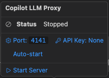
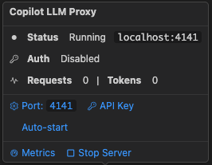
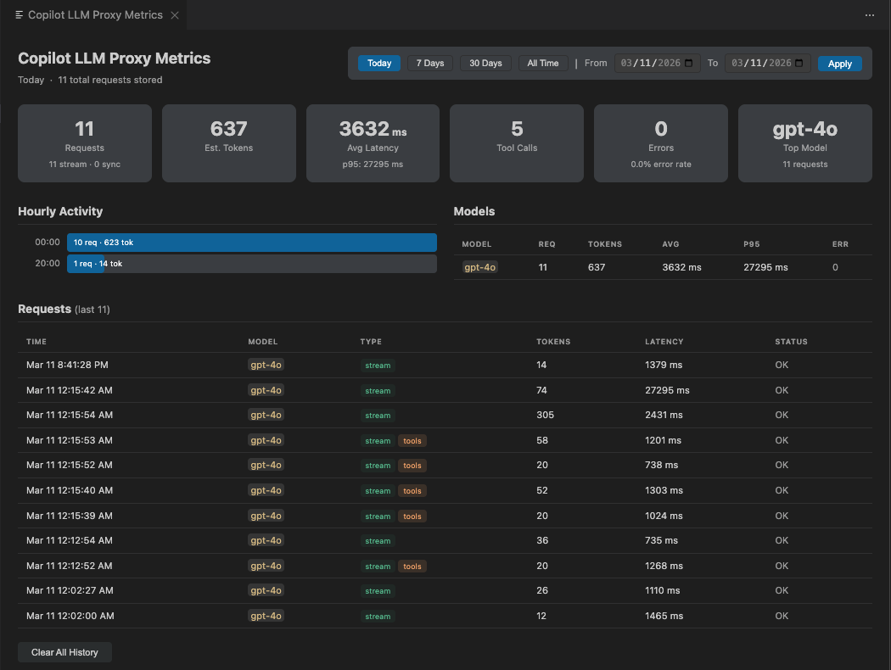

<div align="center">
  
  
  # Copilot LLM Proxy

  A lightweight VS Code extension that bridges GitHub Copilot's Language Model API to an OpenAI-compatible REST API. Zero runtime dependencies.

  [](https://code.visualstudio.com/)
  [](https://github.com/ProSoftTools/COPILOT-LLM-PROXY)
  [](LICENSE)
  [](#)

  [Quick Start](#quick-start) • [Features](#features) • [Usage](#usage) • [Configuration](#configuration) • [Contributing](#contributing)

</div>

## Features

- OpenAI-compatible `/v1/chat/completions` and `/v1/models` endpoints
- Streaming (SSE) and non-streaming responses
- Tool calls / function calling
- Thinking / reasoning tokens
- Image inputs (base64 data URIs)
- Request cancellation on client disconnect
- API key authentication
- Auto-start option

### UI Controls

#### Status Bar

A single status bar item lets you monitor and control the proxy at a glance.

| State | Screenshot |
|-------|-----------|
| **Server stopped** — click to start |  |
| **Server running** — shows active port |  |
| **Live metrics** — request & token counters |  |

#### Rich Tooltip

Hover over the status bar item for a rich tooltip with quick actions — no need to open the Command Palette.

| Before Start | After Start |
|-------------|------------|
|  |  |

The tooltip provides:

- **Server status** — running/stopped with the current port
- **Auth status** — whether API key authentication is enabled
- **Live metrics** — request count and estimated token usage for the current session
- **Quick settings** — change port, configure API key, toggle auto-start
- **Actions** — start/stop server, open metrics dashboard

### Metrics Dashboard

Open via the Command Palette (**Copilot LLM Proxy: View Metrics**) or click the metrics status bar item.



- **Summary cards** — requests, tokens, avg latency, p95, tool calls, errors, top model
- **Hourly activity** — visual breakdown of requests per hour
- **Per-model stats** — request count, tokens, avg/p95 latency, error count
- **Request history** — scrollable table with timestamp, model, type (stream/tools), tokens, latency, status
- **Date range filtering** — Today, 7 Days, 30 Days, All Time, or custom date range
- **Clear history** — wipe all stored metrics

---

## Installation

### VS Code Marketplace

1. Open **Extensions** in VS Code (`Cmd+Shift+X` / `Ctrl+Shift+X`)
2. Search for **Copilot LLM Proxy**
3. Click **Install**

### From `.vsix`

Download the latest `.vsix` from [GitHub Releases](../../releases), then:

```bash
code --install-extension copilot-llm-proxy-*.vsix
```

### Build from Source

```bash
git clone <repo-url> && cd copilot-llm-proxy
npm install
npm run compile
# Press F5 in VS Code to launch Extension Development Host
```

---

## Quick Start

1. Open Command Palette (`Cmd+Shift+P` / `Ctrl+Shift+P`) and run **Copilot LLM Proxy: Start Server**
2. The proxy is now running on `http://localhost:4141`
3. To change the port — hover over the status bar item and click **Port: 4141**, or run **Copilot LLM Proxy: Configure Port**
4. To enable authentication — hover and click **API Key**, or run **Copilot LLM Proxy: Configure API Key**. Clients must then send `Authorization: Bearer <key>`

---

## Usage

The proxy exposes an OpenAI-compatible API at `http://localhost:<port>/v1`. Any tool or SDK that supports the OpenAI API can connect by pointing its base URL to the proxy.

### With any OpenAI-compatible client

Set these two values in your client of choice:

| Setting | Value |
|---------|-------|
| **Base URL** | `http://localhost:4141/v1` |
| **API Key** | any non-empty string (e.g. `unused`) — or the key you configured in settings |

### Authentication

The proxy supports optional API key authentication. When an API key is configured, all requests must include it in the `Authorization` header:

```
Authorization: Bearer <your-api-key>
```

To configure a key, run **Copilot LLM Proxy: Configure API Key** from the Command Palette or click **API Key** in the status bar tooltip. When no key is set, the proxy accepts any non-empty string in the `Authorization` header (most OpenAI SDKs require this field to be present).

### API Endpoints

| Method | Endpoint | Description |
|--------|----------|-------------|
| `GET` | `/v1/models` | List all available models |
| `GET` | `/v1/models/:id` | Get a specific model |
| `POST` | `/v1/chat/completions` | Chat completion (streaming & non-streaming) |

### curl Examples

```bash
# List available models
curl http://localhost:4141/v1/models

# Chat completion
curl http://localhost:4141/v1/chat/completions \
  -H "Content-Type: application/json" \
  -d '{
    "model": "gpt-4o",
    "messages": [{"role": "user", "content": "Hello!"}]
  }'

# Streaming
curl http://localhost:4141/v1/chat/completions \
  -H "Content-Type: application/json" \
  -d '{
    "model": "gpt-4o",
    "messages": [{"role": "user", "content": "Hello!"}],
    "stream": true
  }'

# Tool calls
curl http://localhost:4141/v1/chat/completions \
  -H "Content-Type: application/json" \
  -d '{
    "model": "gpt-4o",
    "messages": [{"role": "user", "content": "What is the weather in Tokyo?"}],
    "tools": [{
      "type": "function",
      "function": {
        "name": "get_weather",
        "description": "Get weather for a location",
        "parameters": {
          "type": "object",
          "properties": {
            "location": {"type": "string"}
          },
          "required": ["location"]
        }
      }
    }]
  }'
```

### Model Resolution

When you specify a model ID in the request, the proxy resolves it in order:

1. Exact match by model `id`
2. Fallback match by model `family`
3. Returns available models in the error if not found

Run `GET /v1/models` to see all available model IDs.

---

## Configuration

| Setting | Default | Description |
|---------|---------|-------------|
| `copilotApiProxy.port` | `4141` | Port number for the proxy server |
| `copilotApiProxy.apiKey` | `""` | API key for authentication. If set, clients must send `Authorization: Bearer <key>` |
| `copilotApiProxy.autoStart` | `false` | Automatically start the proxy when VS Code launches |
| `copilotApiProxy.logLevel` | `INFO` | Log level: `DEBUG`, `INFO`, `WARN`, `ERROR` |

---

## Commands

All commands are available from the Command Palette (`Cmd+Shift+P` / `Ctrl+Shift+P`):

| Command | Description |
|---------|-------------|
| **Copilot LLM Proxy: Start Server** | Start the proxy server |
| **Copilot LLM Proxy: Stop Server** | Stop the proxy server |
| **Copilot LLM Proxy: View Metrics** | Open the metrics dashboard |
| **Copilot LLM Proxy: Configure Port** | Change the server port |
| **Copilot LLM Proxy: Configure API Key** | Set or clear the authentication key |
| **Copilot LLM Proxy: Toggle Auto-start** | Enable or disable auto-start on launch |

---

## Prerequisites

- VS Code 1.93 or later
- GitHub Copilot extension (signed in)
- The first API request triggers a consent dialog to allow Copilot model access — click **Allow**

## Notes

- Token usage counts are estimated (~4 chars/token) since the VS Code LM API doesn't expose exact counts
- The `api_key` field is required by OpenAI SDKs but ignored by the proxy when no key is configured — use any non-empty value

---

## Contributing

Contributions are welcome! Here's how to get started:

1. Fork the repository
2. Create a feature branch (`git checkout -b feature/my-feature`)
3. Make your changes and test them in the Extension Development Host (`F5`)
4. Commit your changes (`git commit -m 'Add my feature'`)
5. Push to your branch (`git push origin feature/my-feature`)
6. Open a Pull Request

### Development Setup

```bash
git clone <repo-url> && cd copilot-llm-proxy
npm install
npm run compile
```

Press `F5` in VS Code to launch the Extension Development Host with the extension loaded.

### Guidelines

- Keep changes focused and minimal
- Follow the existing code style
- Test streaming and non-streaming responses before submitting
- Update documentation if your change affects the public API or configuration

---

## Disclaimer

This extension is not affiliated with, endorsed by, or sponsored by GitHub, Microsoft, or OpenAI. "Copilot" and "GitHub Copilot" are trademarks of GitHub/Microsoft. "OpenAI" is a trademark of OpenAI. All trademarks belong to their respective owners.

## License

[MIT](LICENSE) — Copyright (c) 2026 Ilayanambi Ponramu
